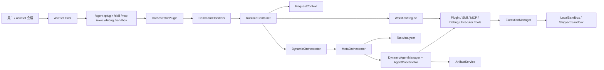
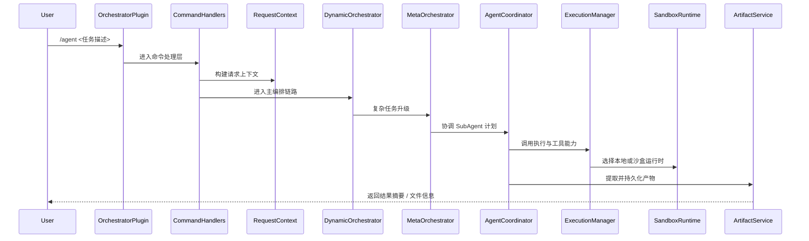

# AstrBot Orchestrator V5

`astrbot_orchestrator_v5` 是一个运行在 `AstrBot` 宿主中的聊天驱动智能体编排插件。  
它把自然语言任务处理、多 `SubAgent` 协作、插件/Skill/MCP 管理、代码执行、工作流和产物持久化统一到一套可测试、可审计、可扩展的运行时中。

这个项目的核心价值，不是再造一个独立 Agent 框架，而是在 `AstrBot` 的命令与上下文体系内，提供一层更接近 `LangGraph` 风格的编排内核：显式请求上下文、清晰的运行时装配、可控的副作用边界，以及对复杂任务的多代理分解能力。

## 质量快照

以下为当前仓库的本地验证结果：

- `435` 个单元测试通过
- `tests/unit` 总覆盖率 `99%`
- `ruff`、`mypy`、`bandit` 持续通过
- 入口层、编排层、运行时、工作流、动态代理、MCP bridge 等关键模块已大面积达到 `100%` 覆盖

## 目录

- [核心能力](#核心能力)
- [适用场景](#适用场景)
- [系统总览](#系统总览)
- [命令入口](#命令入口)
- [工作流能力](#工作流能力)
- [配置要点](#配置要点)
- [项目结构](#项目结构)
- [开发与验证](#开发与验证)
- [文档索引](#文档索引)
- [安全边界](#安全边界)

## 核心能力

- `聊天即入口`：以 `/agent` 为核心命令，也支持 `/plugin`、`/skill`、`/mcp`、`/exec`、`/debug`、`/sandbox` 等专用入口。
- `多 SubAgent 编排`：复杂任务可拆分为多个动态代理协作执行，并由元编排器负责计划、协调与结果汇总。
- `运行时原语清晰`：项目已经引入 `RequestContext`、`RuntimeContainer`、`Prompt -> Model -> Parser` 管道和显式图状态等核心原语。
- `副作用能力适配`：插件安装、Skill 创建、MCP 配置、调试与执行器都被封装为独立能力模块，便于审计与测试。
- `执行环境抽象`：统一接入本地执行与 `Shipyard` 沙盒执行，支持模式选择、健康检查、自动修复与受控回退。
- `工作流引擎`：支持基于 YAML 的声明式工作流，适合稳定流程、模板化流程和多节点控制流。
- `产物持久化边界明确`：代码提取、工作区写入、导出与持久化由 `ArtifactService` 统一处理，不与核心编排链路混杂。
- `工程质量优先`：当前仓库已经建立 `pytest` + `coverage` + `ruff` + `mypy` + `bandit` 的质量门禁。

## 适用场景

- 在 `AstrBot` 中提供一站式的聊天驱动自动化能力
- 将复杂用户请求拆分为多 `SubAgent` 协作任务
- 在聊天中完成插件、Skill、MCP 的运营和运维动作
- 受控地执行代码、生成文件并回传 artifact
- 通过声明式工作流把固定流程沉淀为可复用模板
- 为求职、演示或内部平台构建一套高质量的 Agent 编排样板

## 系统总览

### 主架构图



### 请求流转图



如果你想看更完整的组件关系、执行边界和扩展能力图，见 [docs/architecture.md](docs/architecture.md)。

## 命令入口

| 命令 | 作用 | 常见用法 |
| --- | --- | --- |
| `/agent` | 综合任务入口，适合自然语言请求、多步骤任务和自动编排 | `/agent 帮我分析这个需求并生成实现方案` |
| `/plugin` | 插件市场搜索、安装、卸载、更新与代理查看，安装/卸载/更新需管理员 | `/plugin search 翻译` |
| `/skill` | Skill 列表、创建、编辑、删除、读取，列表/删除/读取需管理员 | `/skill read weather_query` |
| `/mcp` | MCP 服务注册、删除、测试与工具查看，仅管理员可用 | `/mcp test search` |
| `/exec` | 使用统一执行器执行命令或代码，仅管理员可用 | `/exec python print('hello')` |
| `/debug` | 查看状态、日志与问题分析结果，仅管理员可用 | `/debug status` |
| `/sandbox` | 直接使用底层沙盒接口进行执行、文件与包管理，仅管理员可用 | `/sandbox files /workspace` |

完整命令说明见 [docs/commands.md](docs/commands.md)。

## 工作流能力

项目内置 YAML 工作流引擎，适合把稳定流程沉淀成可复用模板。当前支持的节点类型包括：

- `start`
- `agent`
- `skill`
- `mcp`
- `condition`
- `parallel`
- `end`

仓库中已经包含三个可直接参考的样例：

- [workflows/example_simple.yaml](workflows/example_simple.yaml)
- [workflows/example_research.yaml](workflows/example_research.yaml)
- [workflows/example_analysis.yaml](workflows/example_analysis.yaml)

这些样例分别展示了：

- 单轮问答流程
- 多阶段研究与报告生成
- 带条件分支的数据分析工作流

## 配置要点

配置项由 [_conf_schema.json](_conf_schema.json) 定义，最重要的配置可以分成四组：

- `LLM 与编排`
  `llm_provider`、`max_iterations`、`max_parallel_tasks`、`task_timeout`
- `动态 SubAgent`
  `enable_dynamic_agents`、`max_concurrent_agents`、`agent_timeout`、`force_subagents_for_complex_tasks`
- `副作用能力开关`
  `enable_plugin_management`、`enable_skill_creation`、`enable_mcp_config`、`enable_code_execution`
- `执行与安全`
  `auto_fix_sandbox`、`allow_local_fallback`

一个常见的安全起点如下：

```json
{
  "llm_provider": "your_provider_id",
  "enable_dynamic_agents": true,
  "force_subagents_for_complex_tasks": true,
  "enable_code_execution": true,
  "auto_fix_sandbox": true,
  "allow_local_fallback": false
}
```

更完整的配置说明、模板覆盖示例和推荐实践见 [docs/configuration.md](docs/configuration.md)。

## 项目结构

| 路径 | 说明 |
| --- | --- |
| `main.py` | AstrBot 插件注册、命令入口、生命周期管理 |
| `entrypoints/` | 命令处理层，把 AstrBot 事件转换成统一请求 |
| `runtime/` | `RequestContext`、运行时容器、Prompt 管道、图状态等原语 |
| `orchestrator/` | 主编排器、任务分析、SubAgent 协调、代码提取、MCP/Skill 适配 |
| `autonomous/` | 插件、Skill、MCP、执行器、调试等副作用能力 |
| `sandbox/` | 本地与 Shipyard 执行环境抽象 |
| `artifacts/` | 代码提取、工作区写入与 artifact 落盘边界 |
| `workflow/` | 工作流引擎与节点模型 |
| `workflows/` | YAML 工作流样例 |
| `shared/` | 安全条件求值、路径安全等通用能力 |
| `tests/unit/` | 以模块镜像为主的单元测试集合 |

## 开发与验证

### 前置条件

- Python `>= 3.10`
- 可用的 `AstrBot` 宿主运行环境
- 至少一个已配置的 LLM provider
- 如果需要沙盒执行，建议准备好 `Shipyard` 运行环境

### 安装开发环境

```bash
cd "/path/to/astrbot_orchestrator_v5"
uv venv
source .venv/bin/activate
uv pip install -e ".[dev]"
```

### 常用验证命令

```bash
uv run pytest tests/unit
uv run ruff check .
uv run mypy --follow-imports=skip --ignore-missing-imports main.py shared/conditions.py runtime/request_context.py
uv run bandit -q main.py autonomous orchestrator shared runtime sandbox workflow artifacts entrypoints
```

说明：

- `AstrBot` 本身由宿主提供，因此不会作为普通运行时依赖直接声明到包安装链路中。
- 本项目在 `pyproject.toml` 中直接声明的核心依赖主要是 `aiohttp` 与 `PyYAML`。

## 文档索引

- [docs/architecture.md](docs/architecture.md)：完整架构说明与关系图
- [docs/commands.md](docs/commands.md)：命令入口与常见用法
- [docs/configuration.md](docs/configuration.md)：配置项分组与示例
- [SECURITY.md](SECURITY.md)：安全原则与风险边界

## 安全边界

本项目默认把高风险路径收敛到明确边界内：

- 默认拒绝不安全条件表达式
- 默认拒绝路径穿越和危险文件名
- 默认拒绝非管理员触发的高风险副作用
- 默认拒绝不安全的 MCP 地址
- 默认关闭自动回退到本地执行

高风险能力主要包括：

- 代码执行
- 文件写入与持久化
- Skill 创建
- MCP 配置
- 插件安装与更新

这些动作必须由服务端权限策略与安全边界共同控制，不能信任模型输出本身。
