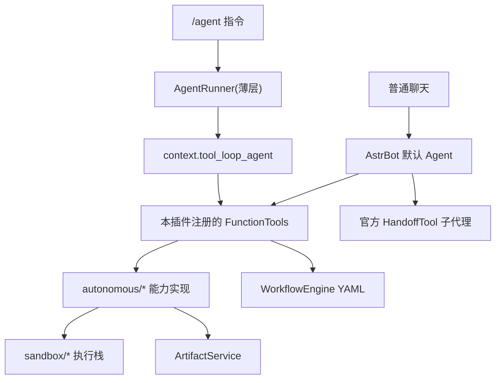

# AstrBot Orchestrator V5

`astrbot_orchestrator_v5` 是一个运行在 `AstrBot >= 4.25` 宿主中的聊天驱动智能体编排插件。

它不再自研 Agent 框架，而是完全构建在 AstrBot 官方 Agent 体系之上：`/agent` 命令由官方 `tool_loop_agent` 驱动，插件/Skill/MCP 管理、沙盒代码执行、自我调试和 YAML 工作流全部封装为官方 `FunctionTool` 注册给宿主，子代理对接官方 `SubAgentOrchestrator`（HandoffTool）。默认聊天 Agent 和 `/agent` 命令共享同一套工具。

## 版本要求

- AstrBot `>= 4.25, < 5`
- Python `>= 3.10`

## 质量快照

- `379+` 个单元测试通过（Linux 全绿；Windows 本机存在少量依赖 WSL/POSIX 语义的沙盒测试噪音）
- `ruff`（全量）、`mypy`、`bandit` 通过
- 测试不依赖真实宿主：`_astrbot_stub/` 按 AstrBot v4.25.5 tag 源码对齐了全部所需 API 签名

## 核心能力

- `官方 Agent 驱动`：`/agent <任务>` = `context.tool_loop_agent` + 本插件注册的 FunctionTool + 宿主既有工具，进度经 `event.send()` 推送。
- `能力即工具`：以下能力以官方 `FunctionTool` 形式注册，默认聊天里 LLM 可直接调用（高危工具内置管理员门控）：
  - `plugin_search / plugin_list / plugin_install / plugin_uninstall / plugin_update`
  - `skill_list / skill_read / skill_create / skill_delete`
  - `mcp_list / mcp_add / mcp_remove / mcp_test / mcp_list_tools`
  - `sandbox_exec_python / sandbox_exec_bash / sandbox_file_read / sandbox_file_write / sandbox_install_packages`
  - `debug_status / debug_recent_errors`
  - `workflow_list / workflow_run`
- `官方子代理`：预设代理模板（research/code/test/debug 等）写入宿主 `subagent_orchestrator` 配置并热加载，由官方 HandoffTool 路由。
- `沙盒执行栈`：本地 / Shipyard 双运行时，模式跟随宿主 `provider_settings.computer_use_runtime`，含健康检查与受控回退。
- `产物持久化`：`ArtifactService` 统一处理代码提取、工作区写入与导出。
- `工作流引擎`：YAML 声明式工作流（start/agent/skill/mcp/condition/parallel/end）。
- `审计与限流`：命令层统一安全审计日志与触发频率限制。

## 系统总览



要点：

- 插件不再有自研规划循环 / 元编排器 / 任务分析器，编排完全交给宿主官方 Agent。
- `/agent` 与默认聊天的差异只是入口与系统提示词，两者使用同一套工具。

## 命令入口

| 命令 | 作用 | 权限 |
| --- | --- | --- |
| `/agent <任务>` | 官方 tool_loop_agent 驱动的综合任务入口 | 所有人（受限流） |
| `/agent status` | 查看官方子代理（handoffs）当前状态 | 所有人 |
| `/agent templates` | 查看预设子代理模板 | 所有人 |
| `/agent sync` | 将模板同步到宿主 subagent 配置并热加载 | 管理员 |
| `/plugin search/list/install/uninstall/update` | 插件市场运维 | 写操作仅管理员 |
| `/skill list/read/create/delete` | Skill 管理 | 管理员 |
| `/mcp list/add/remove/test/tools` | MCP 服务器管理 | 管理员 |
| `/exec <code>` | 统一执行器执行代码 | 管理员 |
| `/sandbox exec/files/read/install` | 底层沙盒接口 | 管理员 |
| `/debug status/errors` | 系统状态与最近错误 | 管理员 |

命令权限由官方 `@filter.permission_type(ADMIN)` 装饰器控制；FunctionTool 的高危操作在工具内部用 `event.is_admin()` 二次门控（非管理员触发时 LLM 收到拒绝文案）。

## 配置要点

配置项由 [_conf_schema.json](_conf_schema.json) 定义：

- `LLM 与编排`：`llm_provider`（留空则跟随会话 provider）、`max_iterations`、`task_timeout`
- `子代理`：`enable_dynamic_agents`（启动时是否同步模板到宿主 subagent 配置）
- `能力开关`（控制对应 FunctionTool 组是否注册）：
  `enable_plugin_management`、`enable_skill_creation`、`enable_mcp_config`、`enable_code_execution`、`enable_self_debug`、`enable_workflows`
- `执行与安全`：`auto_fix_sandbox`、`allow_local_fallback`

## 项目结构

| 路径 | 说明 |
| --- | --- |
| `main.py` | 插件注册、命令组定义、初始化（注册工具 + 同步子代理） |
| `tools/` | 官方 FunctionTool 封装（插件/Skill/MCP/沙盒/调试/工作流） |
| `entrypoints/` | 命令处理层：限流、审计、参数校验 |
| `runtime/` | `RuntimeContainer` 装配、`RequestContext`、执行策略 |
| `orchestrator/` | `AgentRunner`（tool_loop_agent 薄层）、子代理配置适配器、MCP/Skill 适配、代码提取 |
| `autonomous/` | 插件、Skill、MCP、执行器、调试等能力实现 |
| `sandbox/` | 本地与 Shipyard 执行环境抽象 |
| `artifacts/` | 产物提取与落盘边界 |
| `workflow/` + `workflows/` | 工作流引擎与 YAML 样例 |
| `shared/` | 条件求值、路径安全等通用能力 |
| `_astrbot_stub/` | 按 v4.25.5 对齐的宿主 API 测试桩（仅测试用，不随插件加载） |
| `tests/unit/` | 单元测试 |

## 与宿主的耦合点

- 公开 API：`context.tool_loop_agent`、`context.add_llm_tools`、`context.get_config`、`context.get_llm_tool_manager`、`context.get_all_stars`、`context.get_all_providers`、`StarTools.get_data_dir()`、`astrbot.api.logger`。
- **唯一内部依赖**：插件安装/卸载/更新使用 `context._star_manager`（AstrBot 无公开插件管理 API）。该访问点集中在 `autonomous/plugin_manager.py`，若宿主升级导致接口变动只需修改一处。

## 开发与验证

```bash
cd astrbot_orchestrator_v5
uv venv && source .venv/bin/activate
uv pip install -e ".[dev]"

uv run pytest tests/unit
uv run ruff format --check . && uv run ruff check .
uv run mypy --follow-imports=skip shared/conditions.py shared/path_safety.py \
  runtime/request_context.py runtime/container.py entrypoints/command_handlers.py \
  artifacts/service.py orchestrator/agent_runner.py orchestrator/dynamic_agent_manager.py tools
uv run bandit -q -r artifacts entrypoints runtime shared sandbox tools workflow
```

说明：

- `AstrBot` 由宿主提供，不声明为安装依赖；测试经 `tests/conftest.py` 注入 `_astrbot_stub`。
- 直接声明的运行依赖仅 `aiohttp` 与 `PyYAML`。

## 文档索引

- [docs/architecture.md](docs/architecture.md)：架构说明
- [docs/commands.md](docs/commands.md)：命令说明
- [docs/configuration.md](docs/configuration.md)：配置说明
- [SECURITY.md](SECURITY.md)：安全原则与风险边界

## 安全边界

- 默认拒绝不安全条件表达式、路径穿越与危险文件名
- 高危 FunctionTool（安装/写文件/执行代码等）要求触发者为 AstrBot 管理员
- MCP 服务器地址仅允许公网 HTTPS，敏感请求头强制环境变量引用
- 沙盒本地回退默认关闭（`allow_local_fallback: false`）
- 命令层统一审计日志与限流
