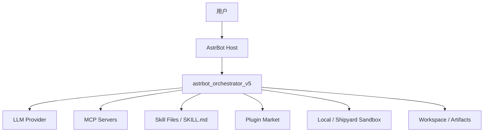
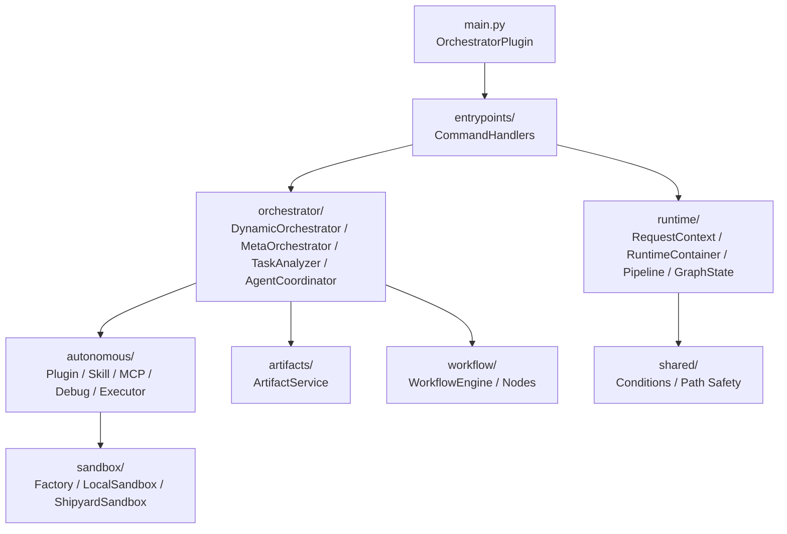
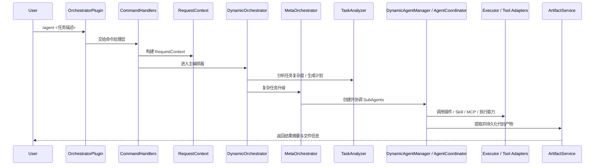
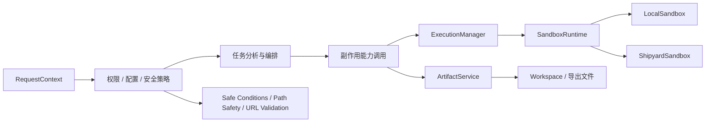
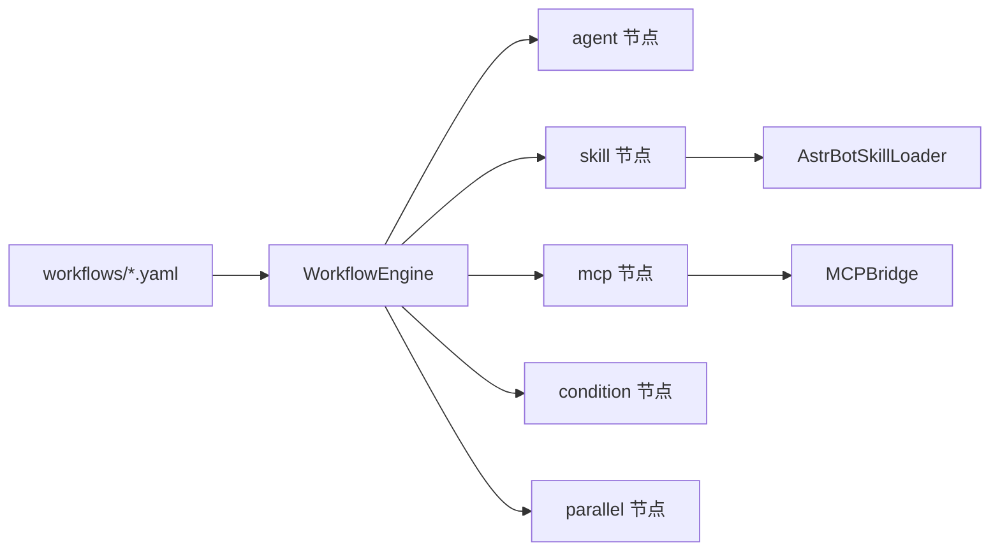

# 架构说明

`astrbot_orchestrator_v5` 是一个运行在 `AstrBot` 宿主中的智能体编排插件。  
它的职责不是取代宿主，而是在宿主提供的命令、上下文和运行时能力之上，提供一层面向复杂任务的编排内核：请求上下文、任务分析、动态 `SubAgent` 协作、工具适配、代码执行以及 artifact 持久化。

## 宿主关系

- `AstrBot`
  负责插件注册、命令入口、上下文对象与宿主能力。
- `astrbot_orchestrator_v5`
  负责意图分析、任务规划、SubAgent 协调、工作流执行、工具调用和结果落盘。
- 外部系统
  包括 LLM provider、MCP 服务、插件市场、Skill 文件系统以及本地 / Shipyard 执行环境。

## 系统上下文图

这张图强调的是系统边界：

- 宿主仍然是 `AstrBot`
- 插件是中间编排层
- 外部依赖包括模型、MCP、Skill、插件市场与执行环境

## 分层结构图

### 分层职责

| 层 | 主要模块 | 职责 |
| --- | --- | --- |
| 入口层 | `main.py`, `entrypoints/` | 插件注册、命令路由、生命周期管理 |
| 运行时层 | `runtime/` | 请求上下文、组件装配、Prompt 管道、图状态 |
| 编排层 | `orchestrator/` | 任务分析、主编排、多代理协作、代码提取 |
| 副作用层 | `autonomous/` | 插件管理、Skill 创建、MCP 配置、调试、执行器 |
| 执行层 | `sandbox/` | 本地与 Shipyard 执行环境抽象 |
| 持久化层 | `artifacts/` | 代码提取、工作区写入与 artifact 边界 |
| 工作流层 | `workflow/` | YAML 工作流定义与节点执行 |
| 安全共享层 | `shared/` | 条件表达式安全求值、路径安全与通用守卫 |

## 请求流转

### `/agent` 主链路

### 为什么主链路以 `DynamicOrchestrator` 为中心

这是当前系统最真实的运行路径：

- `OrchestratorPlugin` 负责 AstrBot 入口和生命周期
- `CommandHandlers` 负责命令级分发
- `RuntimeContainer` 负责把依赖装配为一个可复用运行时
- `DynamicOrchestrator` 是主编排入口
- `MetaOrchestrator`、`TaskAnalyzer`、`DynamicAgentManager`、`AgentCoordinator` 共同完成复杂任务升级与多代理执行

## 执行与持久化边界

### 这里最重要的设计原则

- 编排层不直接混入文件落盘细节，统一交给 `ArtifactService`
- 执行层不直接暴露底层沙盒差异，由 `ExecutionManager` 和 `SandboxRuntime` 统一吸收
- 安全守卫集中在 `shared/` 和能力适配层，不信任模型输出本身
- 本地回退不是默认行为，`allow_local_fallback` 默认关闭

## 工作流与扩展能力

项目除了 `/agent` 主链路，还内置了一套 YAML 工作流能力，用于稳定流程与声明式执行。

### 工作流层适合做什么

- 固定模板流程
- 研究 / 分析 / 汇总型串行任务
- 条件分支和并行节点驱动的自动化流程
- 与 `SkillLoader`、`MCPBridge` 配合的扩展能力

## 关键模块索引

| 模块 | 作用 | 说明 |
| --- | --- | --- |
| `main.py` | 插件入口 | AstrBot 注册、初始化、命令委托、停用清理 |
| `entrypoints/command_handlers.py` | 命令处理层 | 把 AstrBot 事件转为统一请求 |
| `runtime/container.py` | 运行时装配 | 汇聚并绑定组件，减少入口层耦合 |
| `runtime/request_context.py` | 请求上下文 | 封装一次命令调用的元数据和执行策略 |
| `orchestrator/core.py` | 主编排器 | 任务意图识别、编排分发、主流程控制 |
| `orchestrator/meta_orchestrator.py` | 元编排器 | 管理复杂任务和多代理协作 |
| `orchestrator/task_analyzer.py` | 任务分析器 | 生成计划、分解任务、识别复杂度 |
| `orchestrator/dynamic_agent_manager.py` | 动态代理管理 | 创建、持久化、清理动态 `SubAgent` |
| `orchestrator/agent_coordinator.py` | 代理协调器 | 调度任务、聚合输出、控制执行顺序 |
| `autonomous/executor.py` | 执行器 | 统一代码 / 命令执行入口 |
| `sandbox/` | 执行环境 | 提供本地与 Shipyard 两套实现 |
| `artifacts/service.py` | 产物服务 | 负责提取、写入和导出结构化产物 |
| `workflow/engine.py` | 工作流引擎 | 读取并执行 YAML 工作流 |
| `shared/conditions.py` | 安全条件求值 | 为工作流和控制流提供安全表达式求值 |
| `shared/path_safety.py` | 路径安全 | 防止路径穿越与危险写入 |

## 阅读建议

如果你是：

- `使用者`
  先看 [README.md](../README.md)、[docs/commands.md](commands.md)、[docs/configuration.md](configuration.md)
- `插件开发者`
  先看 `main.py`、`entrypoints/command_handlers.py`、`runtime/container.py`
- `编排与 Agent 方向开发者`
  重点看 `orchestrator/`
- `执行与安全方向开发者`
  重点看 `autonomous/`、`sandbox/`、`shared/`
