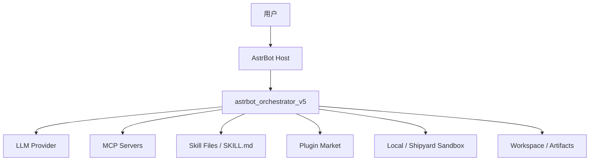
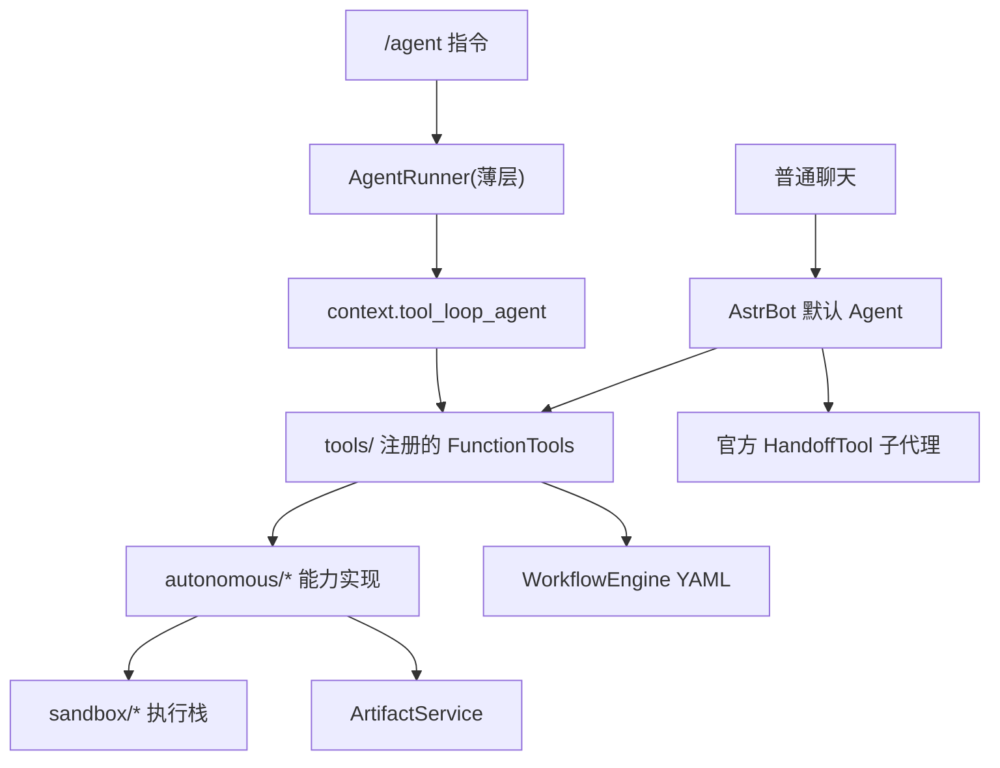
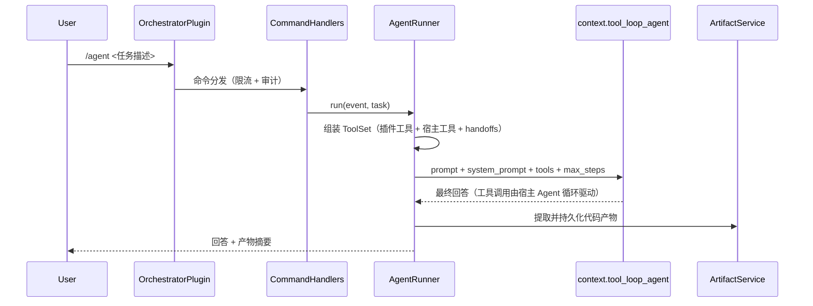
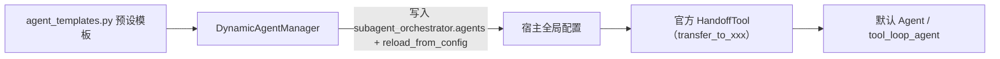
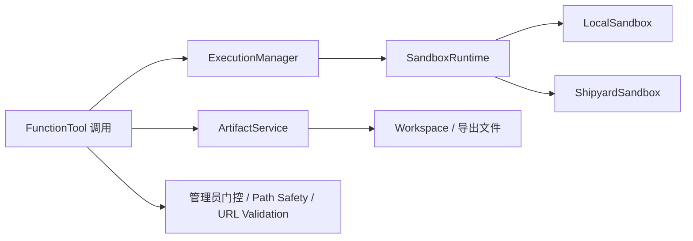

# 架构说明

`astrbot_orchestrator_v5` 是一个运行在 `AstrBot >= 4.25` 宿主中的智能体编排插件。

v4.0 起，插件不再维护自研编排框架（规划循环、任务分析器、元编排器、代理协调器已全部删除），而是直接构建在 AstrBot 官方 Agent 体系上：

- **默认聊天**：能力以官方 `FunctionTool` 注册（`context.add_llm_tools`），由宿主默认 Agent 自然语言调用。
- **`/agent` 命令**：`AgentRunner` 薄层调用官方 `context.tool_loop_agent`，与默认聊天共享同一套工具。
- **子代理**：预设模板写入宿主 `subagent_orchestrator` 配置并热加载，由官方 HandoffTool 路由执行。

## 系统上下文图

## 主架构图

## 分层职责

| 层 | 主要模块 | 职责 |
| --- | --- | --- |
| 入口层 | `main.py`, `entrypoints/` | 命令组注册（`@filter.command_group` + `@filter.permission_type`）、限流、审计 |
| 工具层 | `tools/` | 把能力封装为官方 `FunctionTool`（含管理员门控），按配置开关注册 |
| 编排层 | `orchestrator/` | `AgentRunner`（tool_loop_agent 封装）、`DynamicAgentManager`（子代理配置适配器）、MCP/Skill 适配、代码提取 |
| 运行时层 | `runtime/` | `RuntimeContainer` 装配、`RequestContext`、执行策略 |
| 副作用层 | `autonomous/` | 插件管理、Skill 创建、MCP 配置、调试、执行器 |
| 执行层 | `sandbox/` | 本地与 Shipyard 执行环境抽象 |
| 持久化层 | `artifacts/` | 代码提取、工作区写入与 artifact 边界 |
| 工作流层 | `workflow/` | YAML 工作流定义与节点执行 |
| 安全共享层 | `shared/` | 条件表达式安全求值、路径安全 |

## `/agent` 主链路

要点：

- 插件侧没有自己的推理循环——`tool_loop_agent` 负责 LLM 调用、工具执行与步数控制。
- `AgentRunner` 只做四件事：解析 provider、组装 ToolSet、施加超时、持久化产物。

## 子代理（官方 SubAgentOrchestrator）

- `DynamicAgentManager` 是纯配置适配器：`sync_templates_to_host()` 写配置并触发官方热加载，`status_report()` 读取官方 `handoffs` 状态。
- 子代理的实际执行（路由、上下文传递、结果回传）完全由宿主官方实现承担。

## 执行与持久化边界

设计原则：

- 高危 FunctionTool 在 `run()` 内统一做 `event.is_admin()` 校验，非管理员收到拒绝文案。
- 沙盒模式跟随宿主 `provider_settings.computer_use_runtime`；本地回退默认关闭。
- 落盘统一经 `ArtifactService`，路径安全由 `shared/path_safety.py` 守卫。

## 与宿主的耦合点

公开 API（v4.25.5 校验）：

| API | 用途 |
| --- | --- |
| `context.add_llm_tools` | 注册 FunctionTool |
| `context.tool_loop_agent` | `/agent` 执行 |
| `context.get_config` | 读取全局配置（子代理同步、GitHub 代理） |
| `context.get_llm_tool_manager` | MCP 客户端与工具集 |
| `context.get_all_stars` / `get_all_providers` | 状态报告 |
| `StarTools.get_data_dir` | 插件数据目录 |
| `astrbot.api.logger` | 日志 |

**唯一内部依赖**：`context._star_manager`（插件安装/卸载/更新，无公开替代），集中在 `autonomous/plugin_manager.py` 单一适配点。

## 关键模块索引

| 模块 | 作用 |
| --- | --- |
| `main.py` | 命令组注册、初始化（注册工具 + 同步子代理）、生命周期 |
| `tools/__init__.py` | `build_orchestrator_tools`：按配置开关装配全部 FunctionTool |
| `tools/base.py` | `OrchestratorTool` 基类：runtime 注入 + 管理员门控 |
| `orchestrator/agent_runner.py` | `/agent` = tool_loop_agent 薄层 |
| `orchestrator/dynamic_agent_manager.py` | 官方 subagent 配置适配器 |
| `orchestrator/agent_templates.py` | 预设子代理模板（research/code/test/debug 等） |
| `runtime/container.py` | 运行时装配（能力实现 + 工具 + runner） |
| `entrypoints/command_handlers.py` | 限流、审计、参数校验、能力分发 |
| `autonomous/executor.py` | 统一代码/命令执行入口 |
| `artifacts/service.py` | 产物提取、写入和导出 |
| `workflow/engine.py` | YAML 工作流引擎 |
| `shared/conditions.py` / `shared/path_safety.py` | 安全求值与路径守卫 |

## 阅读建议

- `使用者`：[README.md](../README.md) → [commands.md](commands.md) → [configuration.md](configuration.md)
- `插件开发者`：`main.py` → `runtime/container.py` → `tools/`
- `Agent 方向开发者`：`orchestrator/agent_runner.py` → `orchestrator/dynamic_agent_manager.py`
- `执行与安全方向开发者`：`autonomous/` → `sandbox/` → `shared/`
